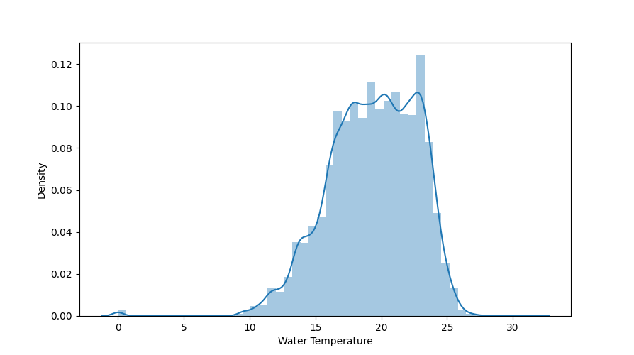
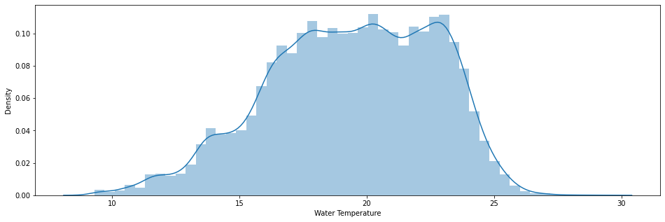

####################################
Correctness
####################################

*********
Description
*********

The data should match the conditions in reality as closely as possible. Measurement data should have as low an error value as possible. 

Detecting anomalies in a dataset can be critical for some businesses if hasty conclusions are drawn or hasty decisions are made.
To rid data sets of such anomalies, these outliers must be identified. Outliers are values that are irrationally far from their expected value.
The danger of outliers is that they influence average values and the standard deviation. 

Outliers can be values of just one variable or combination of at least two variables that can be considered as outliers.

********************
Tools and Libraries
********************

Python
=========

Python provides several methods to easily identifying outliers and statistical anomalies.

Find outliers in a given dataframe 
----------------------------------

The following data set contains sensor data from measuring stations at various beaches. 
For example, water temperature, wave size and wave period were recorded. To load dataset and plot the distribution of the water temperature use the following snippet.

.. literalinclude:: examples/correctness/correctness_dataframe.py

For Normal distributions: Use empirical relations of Normal distribution. The data points which fall below mean-3*(sigma) or above mean+3*(sigma) are outliers.
Where mean and sigma are the average value and standard deviation of a particular column.

In this case, data that is far from 99% quantile is considered as outlier. So the first step is to calculate the maximum and minimum temperature.

.. code-block:: pycon

   In [1]:  "Highest allowed", df["Water Temperature"].mean() + 3 * df["Water Temperature"].std()
            "Lowest allowed", df["Water Temperature"].mean() - 3 * df["Water Temperature"].std()

   Out[2]:  Highest allowed 29.434111975462184
            Lowest allowed 9.292662947927571

Using the limitation created using mean and a multiplication of the standard deviation you can clean and plot the cleaned dataframe.

.. literalinclude:: examples/correctness/correctness_dataframe2.py

MATLAB
=========

C++
=========

********************
Literature
********************