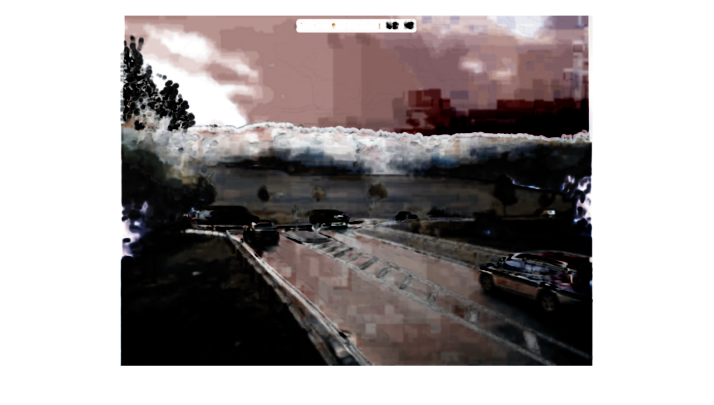
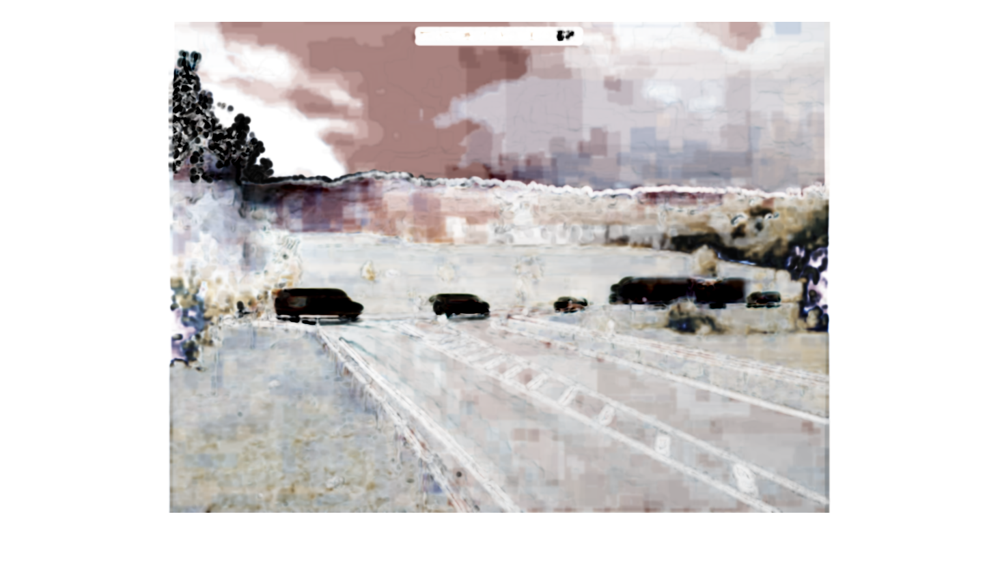

#################################################
Structural Similarity
#################################################

Full-Reference Quality Metrics

*********
Description
*********

The Structural Similarity (SSIM) metric combines local image structure, luminance and contrast into a single local quality score. In this metric, structures are patterns of pixel intensities, especially between adjacent pixels, after normalisation for luminance and contrast. Since the human visual system is good at perceiving structures, the SSIM quality metric better matches the subjective quality assessment.

******************
Interpretation
******************

When an image has maximal pixel differences , the MSE equals zero. As image differences decreases, its value increases.

*********
Limits
*********
The smaller der SSIM values the greater the difference between the pixels.

Only images showing the same scene should be compared. 

******************
Example
******************
Images from a traffic surveillance camera in Germany is used to show the SSIM results.

Reference Image

.. image:: examples/Reference_Image.png
  :width: 640
 
Dark image with SSIM Map. The global SSIM score is 0.48.

.. image:: examples/Image_Dark.png
  :width: 640
  

  
Image with shining sun and the corresponding SSIM Map. The global SSIM score is 0.778.

.. image:: examples/Image_Sunshine.png
  :width: 640
  

Dark areas in the SSIM Map describe low SSIM values. The smaller der SSIM values the greater the difference between the pixels. As you can see by moving objects (cars, trucks) which differ between the images.

********************
Tools and Libraries
********************

Python
=========
In Python the package **sewar** contains multiple image quality metrics. One of them is the SSIM.

Install package:
:: 
  pip install sewar

Calculate MSE:
::
  from sewar.full_ref import ssim
  from PIL import Image

  img1 = Image.open('Reference_Image.png')
  img2 = Image.open('Image_Dark.png')
  ssim(img1,img2) 
  

MATLAB
=========
Within the MATLAB Image Processing Toolbox a function to calculate the SSIM exists:
::
  ref = imread('Reference_Image.png');
  dark = imread('Image_Dark.png');
  sun = imread('Image_Sunshine.png');

  [ssimval,ssimmap] = ssim(dark,ref);
  figure(1)
  imshow(ssimmap,[])
  title("Local SSIM Map with Global SSIM Value: "+num2str(ssimval))

  [ssimval,ssimmap] = ssim(sun,ref);
  figure(2)
  imshow(ssimmap,[])
  title("Local SSIM Map with Global SSIM Value: "+num2str(ssimval))

A detailed description can be found at the `Mathworks Website <https://de.mathworks.com/help/images/ref/ssim.html>`_.

C++
=========
OpenCV contains a class for calculating the SSIM. A detailed description can be found in the `OpenCV Docs <https://docs.opencv.org/4.x/d9/db5/classcv_1_1quality_1_1QualitySSIM.html>`_:
::
  #include <opencv2/quality/qualityssim.hpp>
  #include <iostream>

  int main()
  {
    std::string image_path = samples::findFile("Reference_Image.png");
    cv::Mat img_ref = cv::imread(image_path, cv::IMREAD_COLOR);
    std::string image_path = samples::findFile("Image_Dark.png");
    cv::Mat img_dark = cv::imread(image_path, cv::IMREAD_COLOR);
  
    
    cv::quality::QualityMSE::QualitySSIM SSIM_ref(img_ref);

    cv::Scalar SSIM;
    SSIM = SSIM_ref.compute(img_dark);
  }
  
********************
Literature
********************
